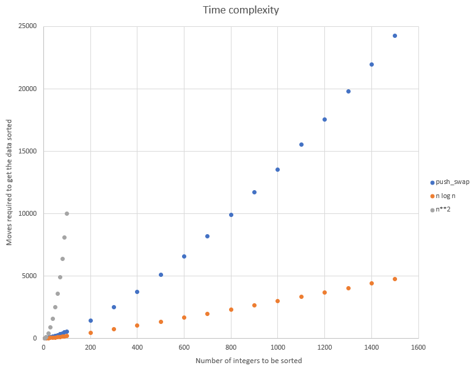

# push_swap

Finding an optimized sorting algorithm for sorting a set of integers with 2 stacks, and a limited set of instructions.

Time complexity of the current implementation as follows, comparing to O(nlogn) and O(n²)
